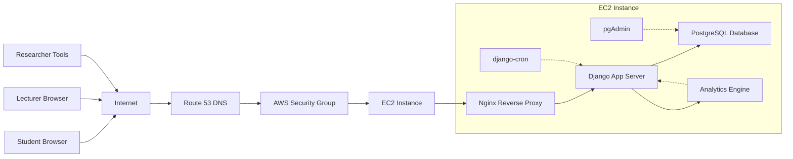
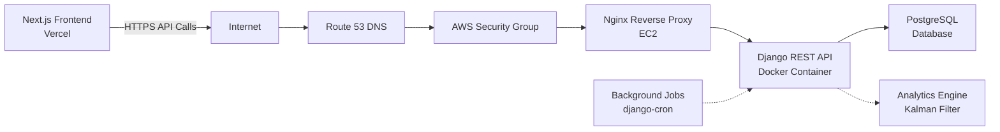
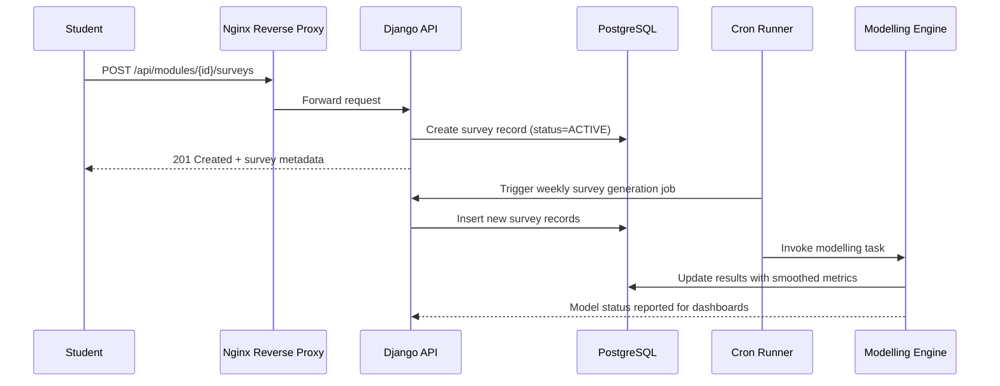
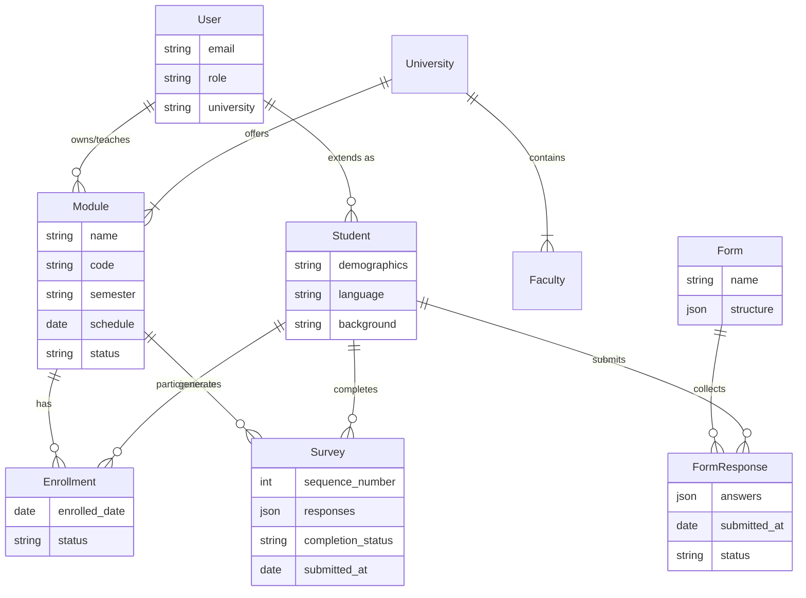
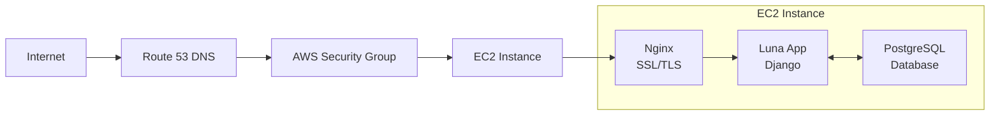

## System Overview

- **Runtime Stack:** Django REST Framework application served from Docker containers, backed by PostgreSQL, with analytics powered by a custom modelling module.
- **Hosting Pattern:** Container stack deployed on AWS EC2, fronted by Nginx for TLS termination, caching, and static asset delivery.
- **Automation:** Cron-driven background jobs create surveys, execute modelling pipelines, and issue alerts without blocking API requests.
- **Observability:** Application logs streamed via Docker, PostgreSQL introspection through pgAdmin, and health endpoints ready for integration into CloudWatch or Datadog.

## Infrastructure Topology

## Full Stack Request Flow

### Nginx Responsibilities

- Terminate HTTPS and enforce secure headers (HSTS, CSP).
- Reverse proxy API traffic to `web` container on port `8000`.
- Serve cached static files from `/var/www/luna/static/` for low latency.
- Expose `/admin` and `/api` under the same domain for simplicity; consider subdomains when scaling.

## Application Layer

| Layer                 | Responsibilities                                                  | Key Components                   |
| --------------------- | ----------------------------------------------------------------- | -------------------------------- |
| **API Gateway**       | REST routing, serializers, authentication, permission enforcement | API endpoints, DRF views         |
| **Domain Layer**      | User management, course modules, surveys, and forms               | Core business logic, data models |
| **Modelling Layer**   | Kalman filter computations, analytics persistence, exports        | Statistical analysis engine      |
| **Cron & Scheduling** | Periodic job orchestration for surveys and analytics              | Background job scheduler         |

## Request Lifecycle Flow

## Data Model Overview

### Entity Relationship Diagram

### Core Entities

**University**

- Represents educational institutions
- Contains multiple faculties and departments
- Supports multi-tenant platform architecture

**User**

- Email-based authentication system
- Three roles: Student, Lecturer, Administrator
- Linked to university affiliation

**Student**

- Extended user profile for student participants
- Stores demographic and academic background
- Tracks language preferences and financial support

**Module (Course)**

- Represents academic courses/subjects
- Configurable semester periods (Winter/Summer)
- Password-protected enrollment system
- Scheduled survey deployment days
- Active/Inactive status management

**Enrollment**

- Links students to their enrolled courses
- Prevents duplicate enrollments
- Tracks enrollment timeline

**Survey**

- Time-series survey instances for longitudinal data collection
- Auto-incremented sequence numbers per student
- Flexible JSON structure for diverse question types
- Completion tracking (Completed/Not Completed)
- Lifecycle status (Active/Archived)

**Form Template**

- Reusable questionnaire blueprints
- JSON-based flexible structure
- Created by lecturers and administrators

**Form Response**

- Student submissions to forms
- Tracks completion status and timestamps
- JSON storage for answers

**Faculty**

- Organizational units within universities
- Groups related departments and programs

## Technology Stack

### Backend Framework

- **Django 4.2.5** - Model-View-Template architecture
- **Django REST Framework 3.14.0** - RESTful API design
- **Custom authentication** - Email-based user system

### Database

- **PostgreSQL** - ACID-compliant relational storage
- **JSON fields** - Flexible survey and form content
- **Database adapter** - psycopg2-binary

### API & Documentation

- **OpenAPI/Swagger** - Interactive API documentation (drf-yasg)
- **CORS support** - Cross-origin resource sharing (django-cors-headers)

### Task Scheduling

- **django-cron** - Periodic job execution
- **Survey automation** - Scheduled deployment system

### Configuration & Deployment

- **Environment management** - python-decouple, python-dotenv
- **Containerization** - Docker, Docker Compose
- **Web server** - Nginx (reverse proxy, SSL termination)

### Cloud Infrastructure

- **Compute** - AWS EC2 instances
- **Deployment** - Dockerized application on EC2
- **Networking** - Nginx reverse proxy with SSL/TLS

## Deployment Architecture

## Background Processing

1. **Survey Generation** - Runs twice daily; creates upcoming survey records based on module schedule and student enrollment.
2. **Analytics Pipeline** - Ingests completed surveys, executes Kalman smoothing, writes metrics to analytics tables for dashboards.

## Security Architecture

### Authentication & Authorization

- Email-based authentication (no username required)
- Secure password hashing using Django's PBKDF2 algorithm
- Role-based access control (Student, Lecturer, Administrator)
- Session-based authentication framework

### Data Protection

- Environment-based configuration (no hardcoded secrets)
- CORS policy enforcement for API security
- SQL injection prevention via ORM parameterization
- XSS protection through template auto-escaping

### Infrastructure Security

- Container isolation and separation
- Docker bridge network segmentation
- HTTPS/TLS encryption in production (Nginx)
- Database access restricted to internal network

## Related Documentation

- [Overview](./overview.md) - Platform introduction and research context
- [Installation Guide](./installation.md) - Environment setup instructions
- [Student Experience](./student-experience.md) - Student user workflows
- [Lecturer Experience](./lecturer-experience.md) - Lecturer and researcher workflows
