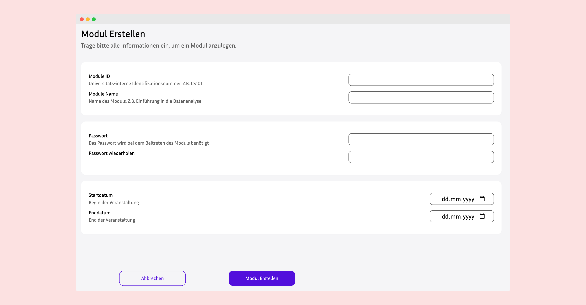
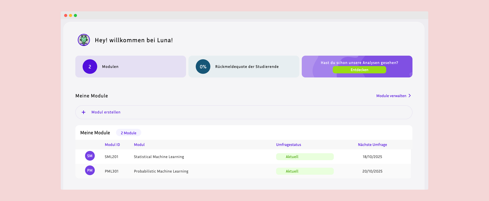
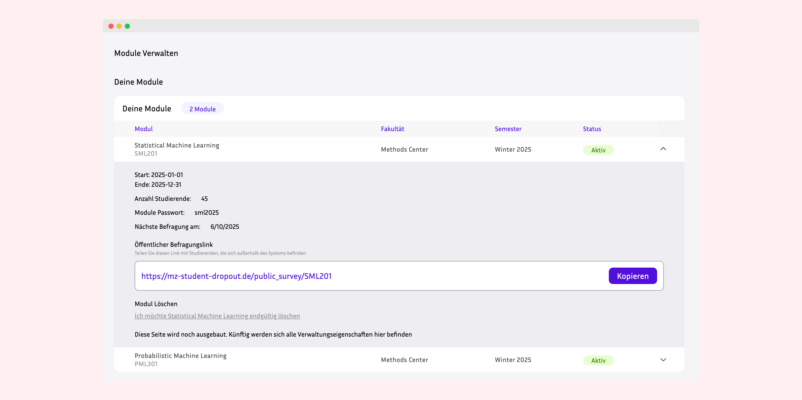
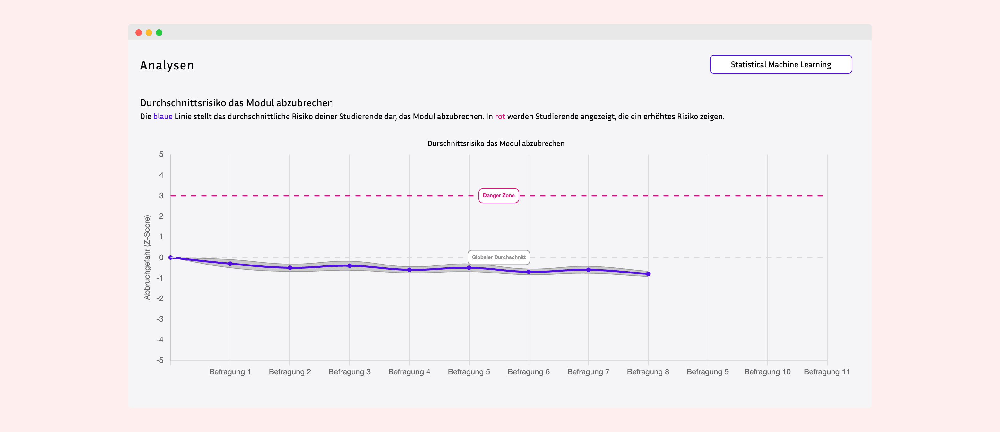

## Lecturer Features & Use Cases

### 1. Account Management

#### Create Lecturer Account

- Register with university email
- Assigned as Lecturer by admin
- Associate with university
- Receive lecturer permissions

---

### 2. Module Management

#### Create New Module

- Define module details:
  - Module name (e.g., "Mathematics I")
  - Module code (e.g., "MATH101")
  - Semester (Winter/Summer)
  - Start and end dates
  - Survey days (select days of week: Monday, Wednesday, etc.)
  - Module password for student enrollment
- Set module status (Active/Inactive)
- Assign to university



#### Configure Module Settings

- Set survey schedule days (e.g., Mondays and Thursdays)
- Define semester period
- Create secure enrollment password
- Update module status

#### Manage Module Access

- Share module password with enrolled students
- Control module activation/deactivation
- Update module information
- Archive completed modules

#### View Module Statistics

- See total enrolled students
- Monitor enrollment trends
- Track student participation
- View module activity



---

### 3. Survey & Form Management

#### Create Survey Forms

- Design custom forms using JSON structure
- Define question types and formats
- Set form metadata (name, description)
- Configure form deployment settings



#### Deploy Surveys

- Surveys auto-deploy on configured survey days
- System automatically creates StudentSurvey instances
- All enrolled students receive surveys simultaneously
- Cron job handles scheduled deployment

#### Monitor Survey Responses

- View survey completion rates
- Track submission timestamps
- See individual student responses
- Monitor resolution status (Completed/Not Completed)

#### Manage Survey Content

- Update survey questions
- Modify form structure (JSON)
- Create multiple survey versions
- Archive old surveys

---

### 4. Student Management

#### View Enrolled Students

- Access list of all students in module
- See student profile information:
  - Name and email
  - Student ID
  - Enrollment date
  - Demographic data (if permitted)

#### Track Student Participation

- Monitor survey completion per student
- View participation rates
- Identify at-risk students (low participation)
- Track longitudinal engagement

#### Manage Enrollments

- Approve/reject enrollments (if manual approval enabled)
- Remove students from module
- View enrollment history
- Export student lists

---

### 5. Data Collection & Analysis

#### Access Survey Data

- View all survey responses for module
- Export data in various formats
- Access raw JSON response data
- Download datasets for analysis

#### Generate Reports

- Survey completion statistics
- Student participation metrics
- Time-series response data
- Module performance indicators



#### Export Data for Research

- Extract structured datasets
- Export to CSV, JSON formats
- Prepare data for statistical analysis
- Support psychometric modeling

---

### 6. Administrative Functions

#### Module Lifecycle Management

- Create module at semester start
- Activate for student enrollment
- Monitor throughout semester
- Deactivate at semester end
- Archive for historical records

#### System Configuration

- Configure survey automation settings
- Manage cron job schedules
- Set notification preferences
- Update module parameters

---

## Lecturer User Workflows

### Typical Semester Setup Workflow

```
1. Create New Module
   ↓
2. Configure Module Settings
   - Set dates (start/end)
   - Select survey days
   - Create enrollment password
   ↓
3. Design Survey Forms
   - Create JSON form structure
   - Define questions
   ↓
4. Activate Module (Status: ACTIVE)
   ↓
5. Share Password with Students
   ↓
6. Students Enroll
   ↓
7. Monitor Enrollments
   ↓
8. Cron Job Deploys Surveys Automatically
   ↓
9. Track Student Participation
   ↓
10. Collect & Analyze Data
   ↓
11. End Semester - Deactivate Module
```

### Weekly Monitoring Routine

```
Survey Day (e.g., Monday)
   ↓
Cron Job Creates StudentSurvey Instances
   ↓
Lecturer Logs into Admin Panel
   ↓
Navigate to Module Dashboard
   ↓
Check Survey Deployment Status
   ↓
Monitor Student Completion Rates
   ↓
Identify Non-Responders
   ↓
Send Reminders (if needed)
   ↓
Review Submitted Responses
   ↓
Export Data for Analysis
```

---

## Lecturer Capabilities Summary

### What Lecturers Can Do:

✅ **Module Management**

- Create and configure modules
- Set survey schedules
- Manage module lifecycle
- Control access with passwords

✅ **Survey Administration**

- Design custom forms (JSON)
- Deploy surveys automatically
- Monitor response rates
- Track completion status

✅ **Student Oversight**

- View enrolled students
- Track participation metrics
- Identify non-responders
- Monitor engagement trends

✅ **Data Management**

- Access survey responses
- Export datasets
- Generate reports
- Prepare research data

✅ **Admin Access**

- Use Django admin panel
- Configure system settings
- Manage users (limited)
- View analytics

✅ **Research Functions**

- Collect longitudinal data
- Export for statistical analysis
- Support psychometric modeling
- Generate insights

---

## Lecturer Interface Components

### Key Admin Panel Sections:

1. **Dashboard** - Overview of owned modules
2. **Modules Management** - CRUD operations for modules
3. **Forms/Surveys** - Create and manage survey instruments
4. **StudentSurvey** - View and export response data
5. **StudentModule** - Monitor enrollments
6. **Users** - View student profiles (limited)
7. **Reports** - Analytics and statistics

### Module Detail View Components:

- **Module Information** - Name, code, dates, status
- **Enrolled Students** - List with participation stats
- **Survey Schedule** - Configured survey days
- **Response Tracking** - Completion rates and trends
- **Data Export** - Download options

---

## Automated Features for Lecturers

### Survey Auto-Deployment

- **Cron Job**: Runs every 12 hours
- **Logic**: Checks current day against module survey_days
- **Action**: Creates StudentSurvey for enrolled students
- **Benefit**: No manual survey distribution needed

### Enrollment Management

- **Student Self-Enrollment**: Password-based system
- **Automatic Profile Creation**: StudentUser auto-created
- **Validation**: Unique student-module constraint
- **Benefit**: Reduced administrative overhead

### Data Integrity

- **Survey Numbering**: Auto-incremented per student-module
- **Timestamp Tracking**: Automatic creation and submission times
- **Status Management**: Resolution auto-updated on submission
- **Benefit**: Clean, structured datasets

---

## Best Practices for Lecturers

### Module Setup

1. Create module at least 1 week before semester start
2. Test survey deployment with sample students
3. Communicate password clearly to students
4. Set realistic survey days (not too frequent)

### Survey Design

1. Keep surveys concise (10-15 minutes max)
2. Use consistent question formats
3. Test JSON structure before deployment
4. Include clear instructions in form

### Data Collection

1. Monitor participation weekly
2. Send reminders for low responders
3. Export data regularly for backup
4. Document survey versions for reproducibility

### Student Communication

1. Explain research purpose clearly
2. Emphasize data privacy
3. Provide technical support
4. Acknowledge participation importance

---

## Benefits for Lecturers

### Research Benefits

- **Automated Data Collection** - Scheduled survey deployment
- **Longitudinal Datasets** - Time-series student data
- **Flexible Survey Design** - JSON-based customization
- **Export Capabilities** - Multiple data formats

### Administrative Benefits

- **Self-Service Enrollment** - Password-based system
- **Automated Tracking** - Participation monitoring
- **Centralized Management** - Single admin interface
- **Scalability** - Support multiple modules/cohorts

### Educational Benefits

- **Student Insights** - Understanding affective states
- **Early Warning** - Identify at-risk students
- **Intervention Support** - Data-driven decisions
- **Course Improvement** - Evidence-based refinements

---

For technical details, see [Architecture Guide](./architecture.md)
For installation, see [Installation Guide](./installation.md)
For student features, see [Student Experience](./student-experience.md)
