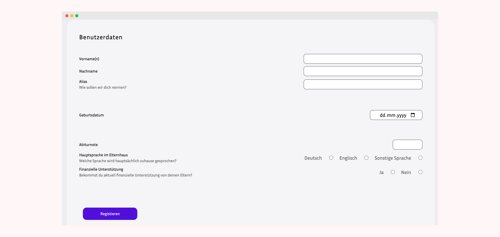
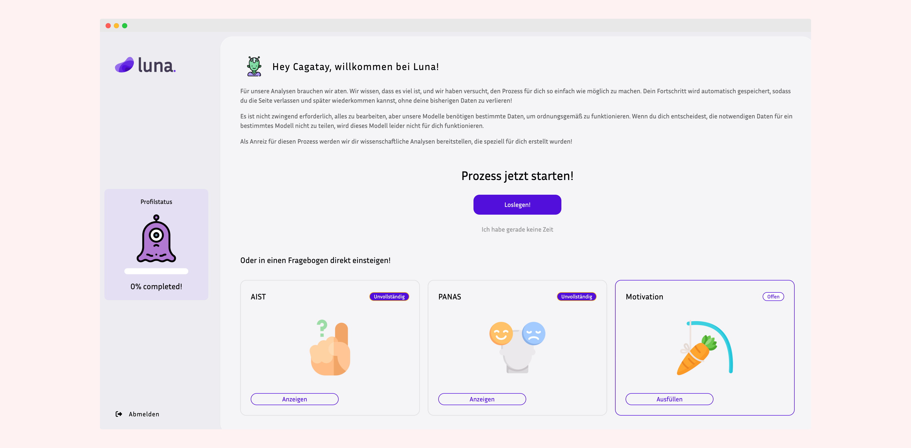
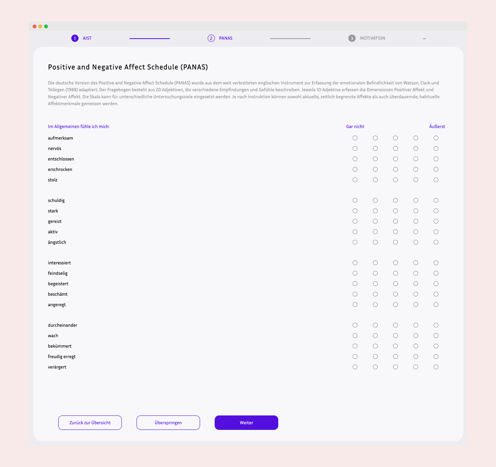
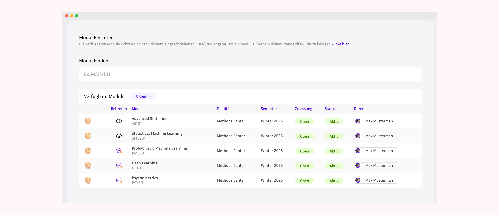
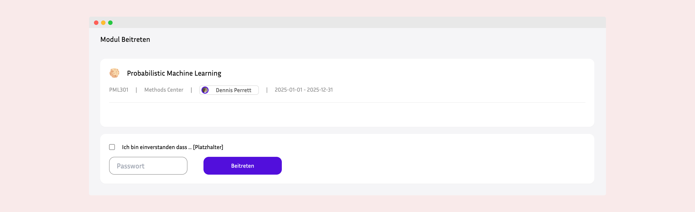
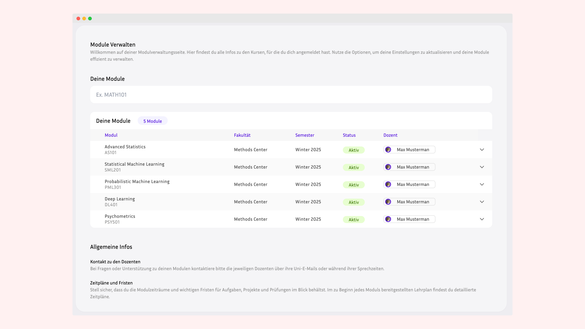
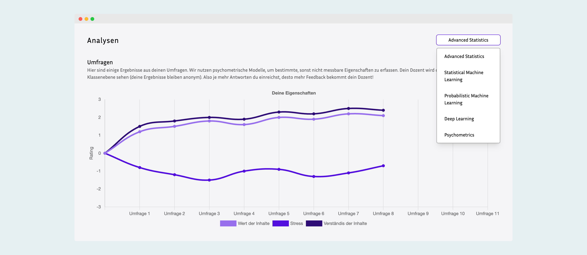

## Student Features & Use Cases

### 1. Account Management

#### Create Account

- Register with email address, first name, and last name
- Receive email verification (if enabled)
- Set secure password
- Select affiliated university

#### Complete Student Profile

- Add personal information:
  - Middle name and nickname
  - Birth date
  - Abitur grade (German university entrance qualification)
  - Main language (English, German, Other)
  - Financial support status



#### Complete Background Questionnaires

- Fill onboarding forms that capture educational history and support needs
- Provide context for personalised monitoring before module enrollment
- Navigate across the background and survey panels — both must be completed to finish onboarding





#### Manage Account Settings

- Update profile information
- Change password
- View account status

---

### 2. Module Enrollment

#### Browse Available Modules

- View list of active modules at your university
- See module details:
  - Module name and code
  - Semester (Winter/Summer)
  - Start and end dates
  - Lecturer/owner information



#### Enroll in Modules

- Enter module password provided by lecturer
- Receive enrollment confirmation
- Access enrolled module dashboard



#### View Enrolled Modules

- See all currently enrolled modules
- Track enrollment status
- Access module-specific information



---

### 3. Survey Participation

#### Receive Surveys

- Automatically receive surveys on scheduled survey days
- Get notifications for new pending surveys
- View survey deadlines and time windows

#### Fill Out Surveys

- Access survey forms from dashboard
- Answer questions (various types supported via JSON structure)
- Save progress (if enabled)
- Submit completed surveys


#### Track Survey History

- View all past surveys
- See completion status (Completed/Not Completed)
- Review survey numbers and dates
- Access survey timeline per module

#### Manage Survey Status

- View pending surveys requiring completion
- Track submission timestamps
- Monitor survey resolution status

---

### 4. Data & Analytics

#### View Personal Analytics

- See survey completion rates
- Track participation statistics
- View progress over time per module



#### Access Survey Results

- Review own submitted responses (if permitted)
- Track longitudinal data collection
- Monitor engagement metrics

---

### 5. Dashboard & Navigation

#### Student Dashboard

- Central hub for all student activities
- Quick access to:
  - Pending surveys
  - Enrolled modules
  - Recent activity
  - Important notifications

#### Module-Specific Views

- Individual dashboards for each enrolled module
- Module-specific surveys and forms
- Participation history per module

---

## Student User Workflows

### Typical Student Journey

```
1. Register Account
   ↓
2. Complete Student Profile
   ↓
3. Receive Module Password from Lecturer
   ↓
4. Enroll in Module
   ↓
5. Wait for Survey Day
   ↓
6. Receive Survey Notification
   ↓
7. Fill Out Survey
   ↓
8. Submit Survey
   ↓
9. Repeat for Each Survey Period
   ↓
10. Complete Semester
```

### Weekly Survey Routine

```
Monday (Survey Day)
   ↓
Receive New StudentSurvey
   ↓
Login to Dashboard
   ↓
Navigate to Pending Surveys
   ↓
Open Survey Form
   ↓
Answer All Questions
   ↓
Submit Survey
   ↓
Survey Marked as COMPLETED
```

---

## Use Case Examples

### Use Case 1: New Student Enrollment

**Actor**: First-year mathematics student

**Steps**:

1. Receive welcome email with platform link
2. Create account with university email
3. Fill in demographic information (birth date, Abitur grade, language)
4. Receive module password from mathematics lecturer
5. Navigate to "Enroll in Module" section
6. Enter module code and password
7. Successfully enrolled in "Mathematics I - Winter Semester"

**Outcome**: Student is now enrolled and will receive surveys on configured days

---

### Use Case 2: Completing Weekly Survey

**Actor**: Enrolled student

**Steps**:

1. Receive notification on Monday (survey day)
2. Login to platform
3. See "1 Pending Survey" on dashboard
4. Click on survey for "Mathematics I"
5. Answer questions about:
   - Current emotional state
   - Study hours this week
   - Difficulty level of material
   - Confidence in understanding
6. Click "Submit Survey"
7. Receive confirmation message

**Outcome**: Survey marked as completed, data stored in StudentSurvey JSON content

---

### Use Case 3: Tracking Progress

**Actor**: Student mid-semester

**Steps**:

1. Navigate to "My Modules" section
2. Select "Mathematics I" module
3. View survey history:
   - Survey #1 (Week 1): Completed ✓
   - Survey #2 (Week 2): Completed ✓
   - Survey #3 (Week 3): Not Completed ✗
   - Survey #4 (Week 4): Completed ✓
4. See completion rate: 75% (3/4 surveys)
5. Review submission dates and times

**Outcome**: Student aware of participation status and can plan accordingly

---

### Use Case 4: Managing Multiple Modules

**Actor**: Student enrolled in multiple courses

**Steps**:

1. Enrolled in:
   - Mathematics I (Mondays & Thursdays)
   - Statistics (Wednesdays)
   - Linear Algebra (Fridays)
2. Dashboard shows separate survey counters per module
3. Complete surveys for each module on respective days
4. Track progress independently for each course

**Outcome**: Organized participation across multiple modules

---

### Use Case 5: Updating Profile Information

**Actor**: Returning student

**Steps**:

1. Navigate to profile settings
2. Update financial support status (received scholarship)
3. Update preferred language setting
4. Add nickname for informal communications
5. Save changes

**Outcome**: Profile updated, information available for research analysis

---

## Student Capabilities Summary

### What Students Can Do:

✅ **Account & Profile**

- Create and verify account
- Manage personal information
- Update profile details
- Change credentials

✅ **Module Management**

- Browse available modules
- Enroll with password
- View enrolled modules
- Access module details

✅ **Survey Interaction**

- Receive scheduled surveys
- Fill out survey forms
- Submit responses
- Track completion status

✅ **Data Viewing**

- View survey history
- See completion rates
- Track participation
- Monitor progress

✅ **Dashboard**

- Access centralized dashboard
- View pending tasks
- Navigate modules
- See notifications

### What Students Cannot Do:

❌ Create or modify modules
❌ Access other students' data
❌ Change survey schedules
❌ Delete submitted surveys
❌ View aggregated analytics
❌ Manage lecturer functions
❌ Access admin features

---

## Student Interface Components

### Key Pages/Views:

1. **Login/Registration Page**
2. **Student Dashboard** (Main Hub)
3. **Profile Management Page**
4. **Module Enrollment Page**
5. **Enrolled Modules List**
6. **Survey Form Page**
7. **Survey History Page**
8. **Module Details Page**

### Dashboard Widgets:

- **Pending Surveys** - Quick access to incomplete surveys
- **Enrolled Modules** - List of active enrollments
- **Recent Activity** - Latest survey submissions
- **Completion Statistics** - Progress tracking

---

## Benefits for Students

### Academic Benefits

- Structured participation in research
- Self-awareness of learning patterns
- Regular reflection on academic progress
- Contribution to educational improvement

### User Experience Benefits

- Simple, intuitive interface
- Clear task management
- Progress tracking
- Organized survey workflow

### Privacy & Security

- Secure authentication
- Protected personal data
- Controlled data access
- Research ethics compliance

---

For technical details, see [Architecture Guide](./architecture.md)
For installation, see [Installation Guide](./installation.md)
For lecturer features, see [Lecturer Experience](./lecturer-experience.md)
